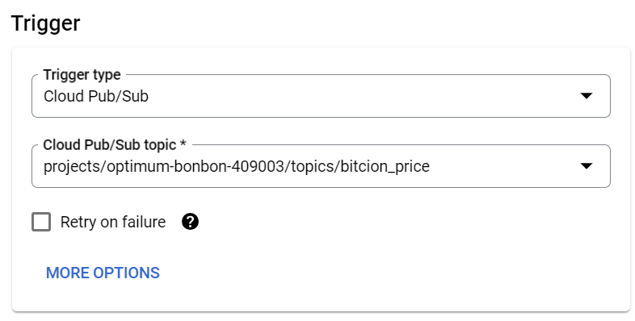
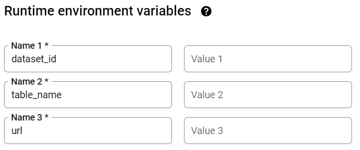
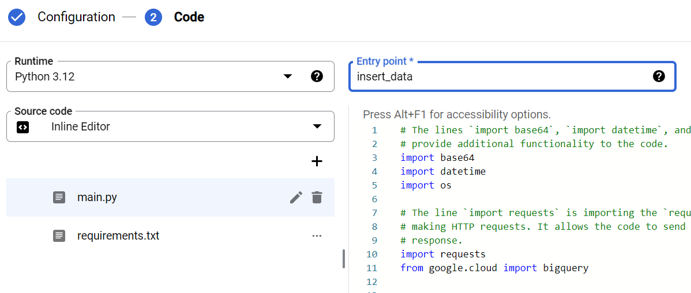
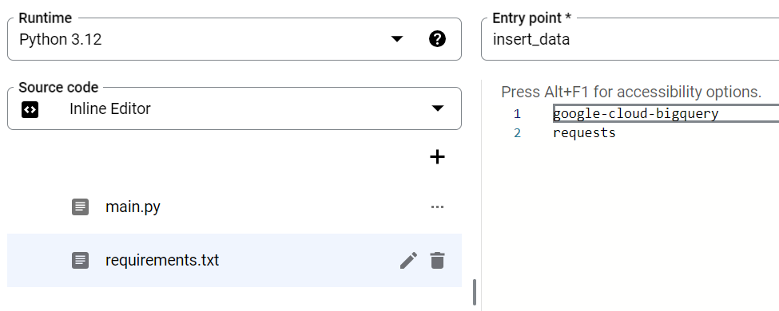
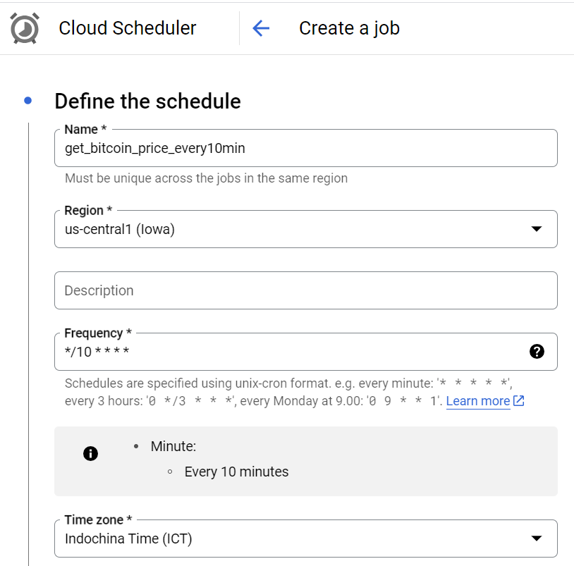
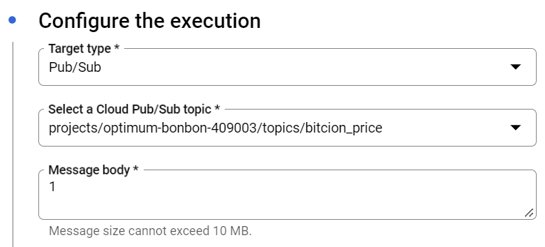
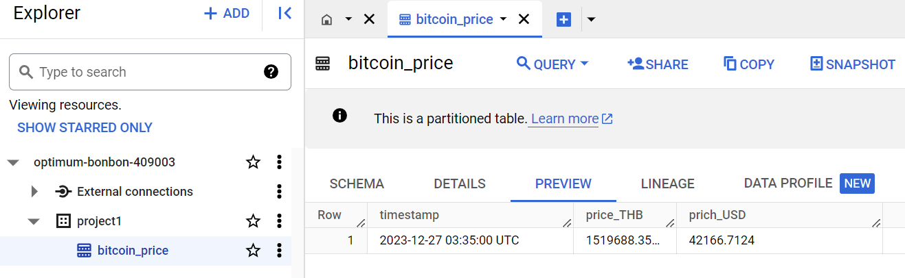

# LOW COST DATA PIPELINE

## Step
1. Create Big Query
2. Create Cloud Function, 
   >2.1 set the type of trigger is Cloud Pub/Sub  set Topic (Can create new topic)
   

   >2.2 set runtime environment variables
   

   >2.3 set Code

   

   > 2.4 set requirements
   

3. Create Google Cloud Schedule and test crick Run
   
   
   
4. Check on Big Query
   
   
   
## About total the cost in the pipeline
- Bigquery : use 5 GB/month in this case we insert 1 row assume 1 KB that it free for 5 million rows
- Cloud Function : Use 2 million/month free
- Cloud Pub/Sup : Use 50 GB/month free in this case we sended just "1".
- Cloud Schedule : Can have 3 schedule.
- Streaming insert in Cloud to Big Query : 
  $0.01/200 MB

## Referent
- https://github.com/fonylew/simple-cloud-functions-to-bigquery
- https://www.coindesk.com/coindesk-api
- https://api.coindesk.com/v1/bpi/currentprice/THB.json
- https://cloud.google.com/pricing?hl=en
